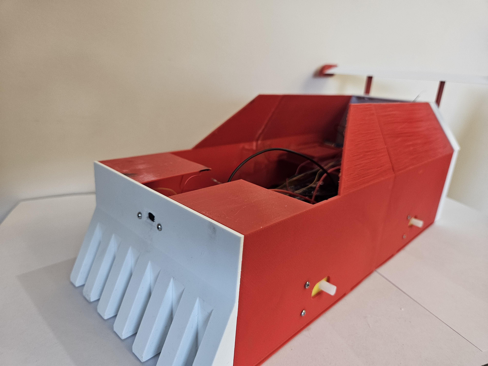
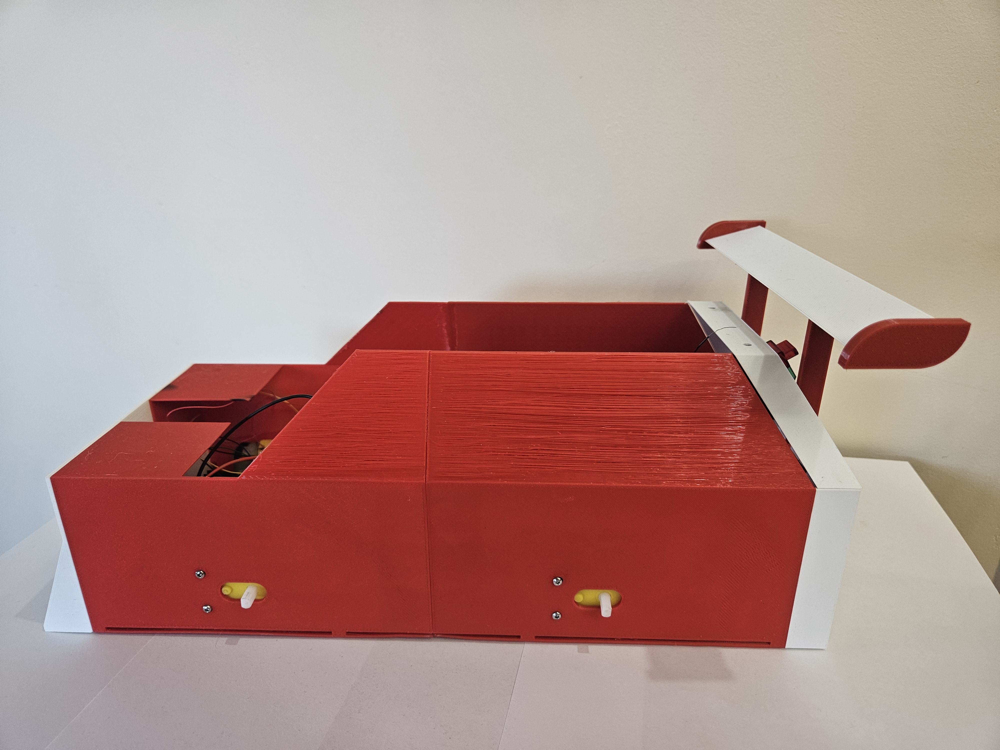
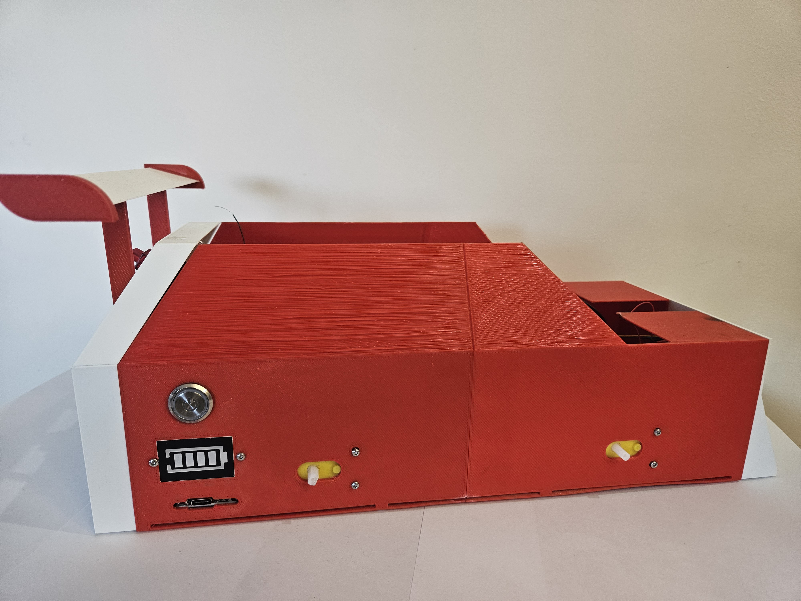
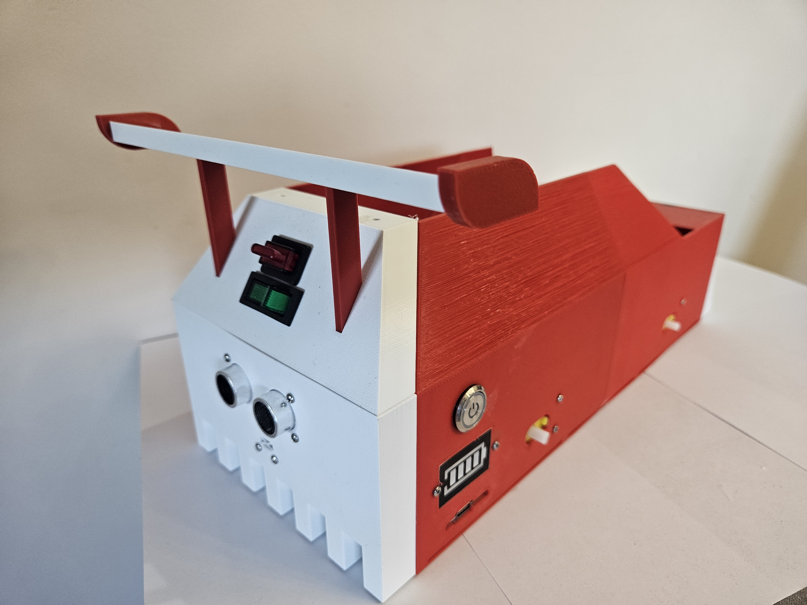
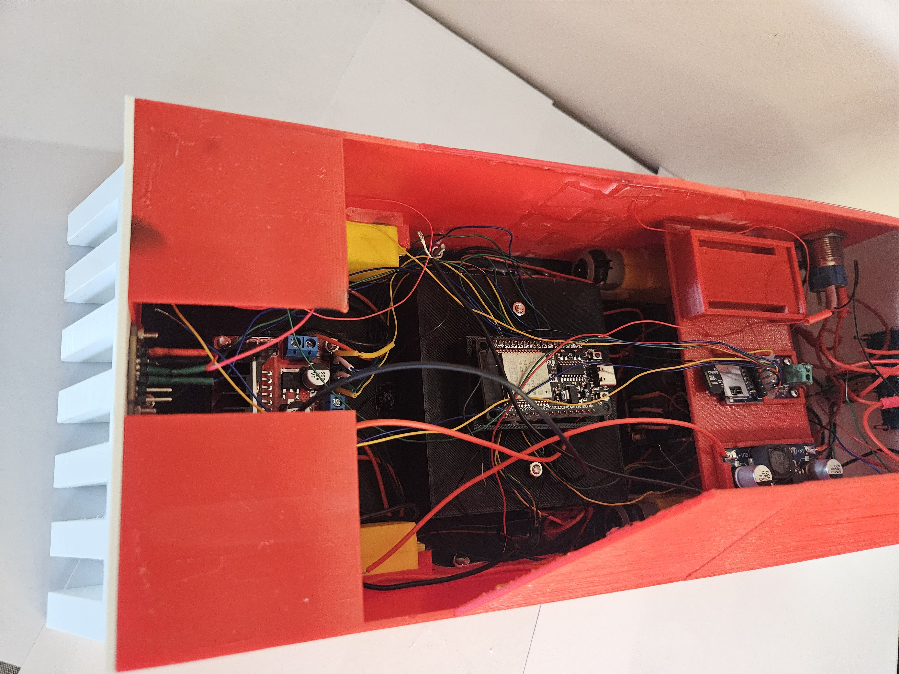
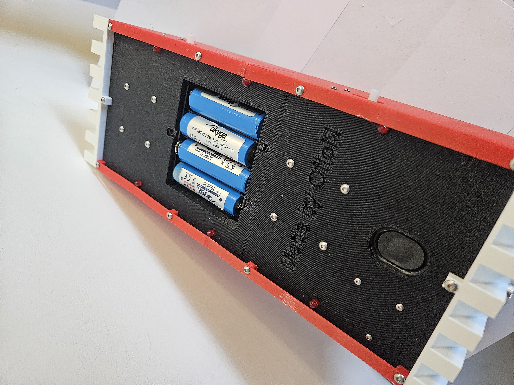

<h1 align="center"> Autonomous Mini Car 🏎️🤖 </h1>

ESP32-powered mini F1-style robot car with Wi-Fi control, person-following computer vision and a fully custom 3D-printed chassis.  
The project is **work in progress** – both the electronics and the software are still actively developed.

📐 Enclosure Model
<p align="center">
  
  
</p>
🛠️ Final Product
<p align="center"><table> <tr> <td></td> <td></td> </tr> </table></p>

<p align="center"><table> <tr> <td></td> <td></td> </tr> </table></p>

<p align="center"><table> <tr> <td></td> <td></td> </tr> </table></p>

---

## ✨ Features

- 🧠 **Wi-Fi controlled ESP32** – onboard web server with simple control UI (forward / back / left / right / stop).
- 🛞 **Dual DC motor drive** – tank-style steering using an H-bridge and four control pins.
- 👁️ **Person-following mode** – external Python script with OpenCV detection decides where the car should move.
- 📷 **Camera-based control** – ESP32-CAM stream is processed on a laptop.
- 🧩 **Custom 3D-printed chassis** – STL files included for the body and spoiler.
- 🚧 **Still in development** – code and mechanics are being iterated and improved.

---

## ⚙️ Hardware

- **Main MCU:** ESP32 DevKit (motor controller)  
- **Camera:** ESP32-CAM (video stream for person detection)  
- **Motors:** 2× DC motors with H-bridge driver  
- **Power:** Li-ion / LiPo battery (TODO: add details)  
- **Chassis:** 3D-printed F1-style body (STL files in `hardware/stl`)

Motor control pins on ESP32:

```cpp
#define IN1 18  // left motor forward
#define IN2 19  // left motor backward
#define IN3 22  // right motor forward
#define IN4 23  // right motor backward
```

## 📂 Structure
```
AutonomousMiniCar/
│
├── firmware/
│   ├── src/
│   │   └── main.cpp
│   └── platformio.ini
│
├── vision/
│   └── person_follow.py
│
├── hardware/
│   └── stl/
│
└── docs/
    └── images/ 
    └── gif/
```
