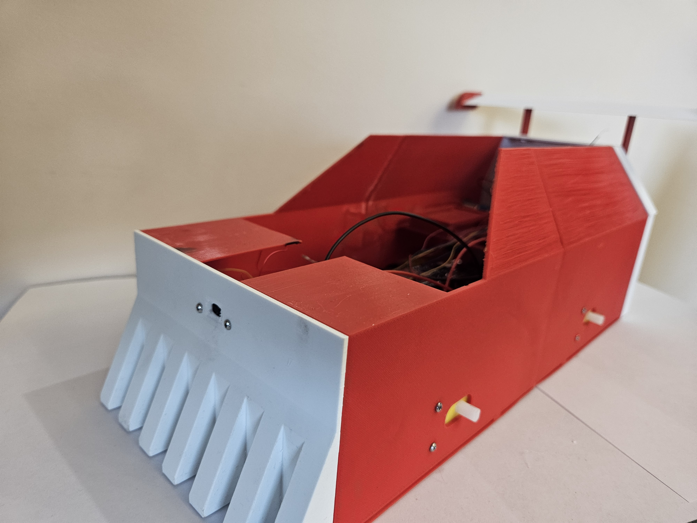
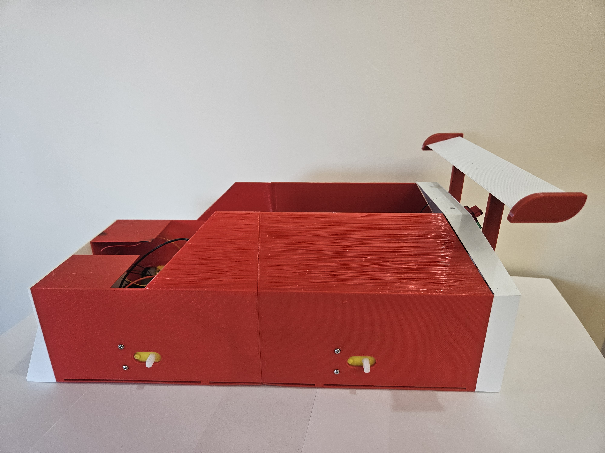
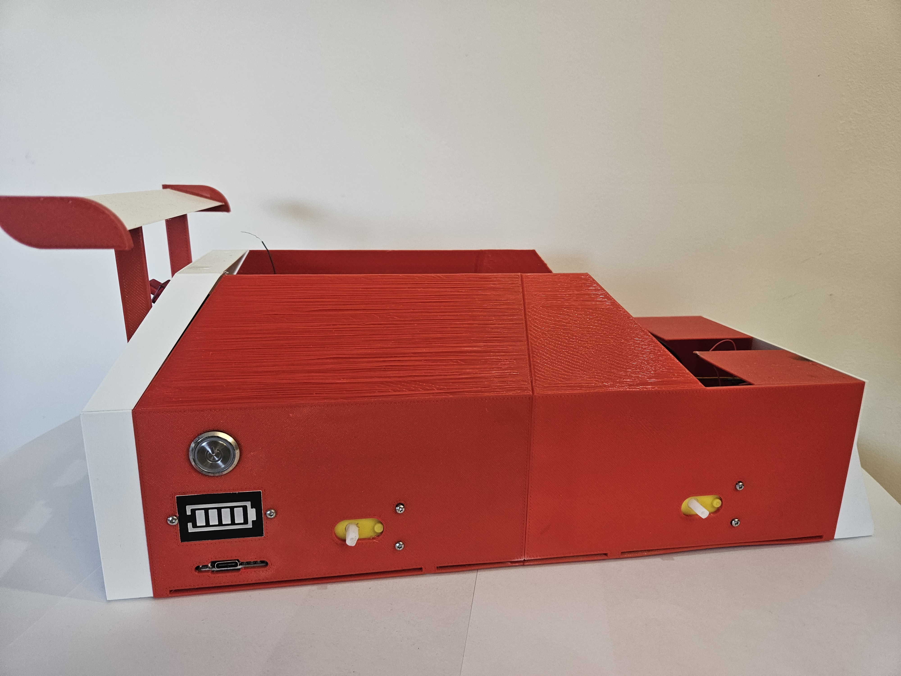
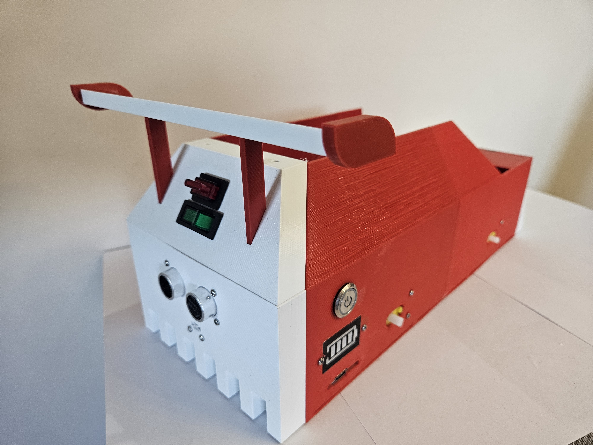
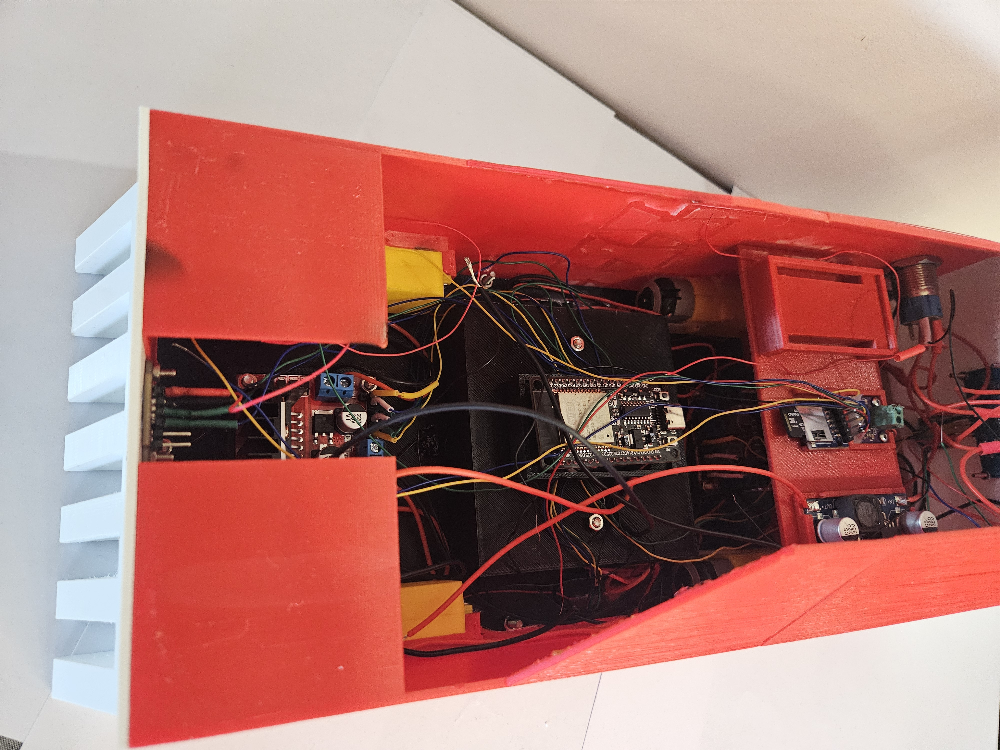
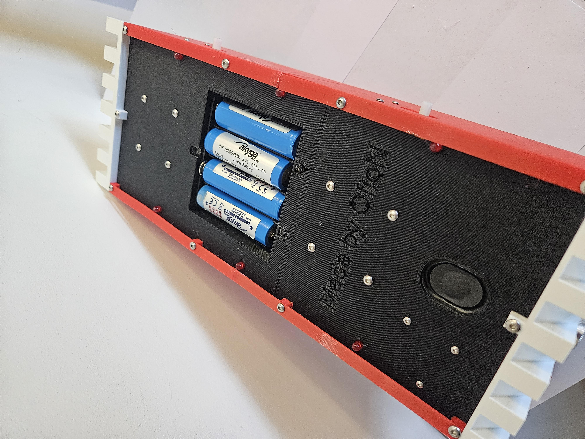

<h1 align="center"> Autonomous Mini Car </h1>

<p align="center">
  
  
  
  
</p>

An ESP32-powered autonomous mini robot car with Wi-Fi control, person-tracking computer vision, multiple onboard sensors and a fully custom 3D-printed chassis.  
The project is **still in active development**, with ongoing work on mechanics, electronics, and autonomous behavior.

---

## Enclosure Model

<p align="center">
  
  
</p>

---

## Final Product

<p align="center">
<table>
  <tr>
    <td></td>
    <td></td>
  </tr>
</table>
</p>

<p align="center">
<table>
  <tr>
    <td></td>
    <td></td>
  </tr>
</table>
</p>

<p align="center">
<table>
  <tr>
    <td></td>
    <td></td>
  </tr>
</table>
</p>

---

## Features

- **Wi-Fi controlled ESP32** - onboard HTTP server exposes simple navigation controls (forward, back, left, right, stop).
- **Dual-motor drive system** - tank-style differential steering using L298N motor drivers.
- **Person-following mode** - Python + OpenCV script processes ESP32-CAM video and sends movement commands to the vehicle.
- **Camera-based control** - ESP32-CAM handles live video streaming.
- **Multiple onboard sensors** - ToF distance, ultrasonic, environmental sensing and more.
- **Audio output system** - I2S amplifier + speaker.
- **Custom 3D-printed F1-inspired chassis** - STL files included for printing.
- **Work in progress** - new sensors, AI logic and mechanical improvements are continuously added.

---

## How It Works (Architecture Overview)

The system is composed of three cooperating modules:

### 1. **ESP32 Motor Controller**
- Hosts a lightweight HTTP server.
- Receives movement commands (`/forward`, `/left`, `/stop`, etc.).
- Controls both L298N motor drivers.
- Reads sensor data in future updates (ToF, HC-SR04, etc.).

### 2. **ESP32-CAM Video Module**
- Streams MJPEG video over Wi-Fi.
- Provides the visual input for person tracking.
- Can store images or sensor logs on the SD card.

### 3. **Python Vision System**
- Processes the video stream using OpenCV DNN.
- Detects a person and calculates steering decisions.
- Sends commands back to the ESP32 motor controller.
- Acts as the “brain” of the autonomous mode.

### Communication Flow
```
ESP32-CAM → Python Vision Script → ESP32 Motor Controller → Motors
```

---

## Hardware Overview

### Core Components
- **MCUs:**  
  - 2× ESP32 DevKit (motor control + main logic)  
  - 1× ESP32-CAM (video streaming + detection)

- **Motors & Drivers:**  
  - 4× wheel + gear-motor set 65×26 mm, 5V, 48:1  
  - 2× L298N dual-channel motor drivers  

- **Power & Power Management:**  
  - 4× 18650 Li-ion INR18650-F1AN, 2200 mAh each
  - 4-slot 18650 battery holder
  - LM2596 step-down converters (3.2–35V, 3A)  
  - IP2369 45W BMS (supports 2S–6S lithium packs)  
  - 4S Li-ion battery level indicator  

- **Sensors:**  
  - VL53L0X ToF distance sensor  
  - HC-SR04 ultrasonic module  
  - KY-008 laser module  
  - AHT20 + BMP280 (temperature, humidity, pressure)  
  - Photoresistor (LDR)  

- **Other Electronics:**  
  - 2× 1.3" OLED displays (I2C)  
  - MAX98357A I2S 3W audio amplifier  
  - 4 Ω / 3W speaker  
  - MicroSD SPI card reader  
  - LEDs: 8× red, 2× blue
  - 3× switches  

---

## Repository Structure


```
AutonomousMiniCar/
│
├── firmware/          # ESP32 motor controller (PlatformIO)
│   ├── src/
│   │   └── main.cpp
│   └── platformio.ini
│
├── vision/            # Python + OpenCV person-following logic
│   └── person_follow.py
│
├── hardware/          # 3D-printable chassis files
│   └── stl/
│
└── docs/
    ├── images/
    └── gif/
```

---

## How to Run

### 1. Firmware (ESP32 Motor Controller)
1. Open `firmware/` in PlatformIO.
2. Insert your Wi-Fi credentials into `main.cpp`:
```cpp
const char* ssid = "YOUR_WIFI";
const char* password = "YOUR_PASS";
```
3. Upload to ESP32.
4. Check the serial monitor for the assigned IP.
5. Open the IP in a browser to access the control UI.

### 2. ESP32-CAM Video Stream
1. Flash any ESP32-CAM MJPEG streaming example.
2. Note the stream URL (e.g. http://192.168.x.x:81/stream).
3. Update the Python script with this URL.

### 3. Python Person Tracking
```
pip install opencv-python requests
python person_follow.py
```

---

## Motor Control

```cpp
#define IN1 18  // left motor forward
#define IN2 19  // left motor backward
#define IN3 22  // right motor forward
#define IN4 23  // right motor backward
```

---

## What I Learned

Working on this project taught me a wide range of practical skills across electronics, embedded systems, 3D design and computer vision:

### Embedded Systems & Microcontrollers
- Configuring multiple ESP32 boards for different roles (motor control, video streaming, sensor data).
- Implementing an HTTP server on ESP32 for real-time remote control.
- Managing GPIO pins, PWM output, and motor direction logic.
- Integrating modular drivers such as L298N, I2S audio modules and SD card readers.

### Electronics & Power Management
- Designing a multi-module power system with step-down converters, BMS and 4× 18650 Li-Ion cells.
- Ensuring stable voltage regulation for motors, logic circuits and sensors.
- Understanding current draw, heat dissipation, and safe Li-ion usage.
- Building full wiring architecture including indicators, OLED displays, LEDs, switches and sensors.

### Computer Vision & Python
- Streaming and decoding MJPEG video from ESP32-CAM.
- Using OpenCV (DNN) to detect and track a person in real time.
- Translating bounding box position into movement commands.
- Managing communication between Python and ESP32 using HTTP endpoints.

### 3D Modeling & Mechanical Design
- Designing and iterating a 3D-printed chassis.
- Making mechanically stable mounts for electronics, motors and battery systems.

### System Architecture & Prototyping
- Building a multi-component system where firmware, sensors and vision logic communicate together.
- Debugging wireless delays, signal noise, motor control issues and real-world mechanical limitations.
- Structuring a scalable repository with separate firmware, hardware and computer vision modules.

---


## License

This project is licensed under the MIT License - feel free to use, modify, or experiment with it.
